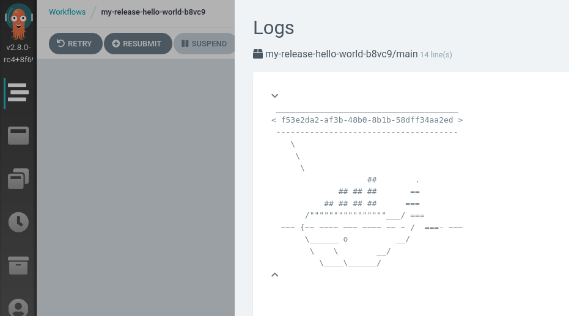

<div class="cover-image">
  </img>
  <p class="image-credit">Photo by <a href="https://unsplash.com/@clicclac">F S</a> on Unsplash</p>
</div>

Argo is a lightweight, Kubernetes-native workflow solution.
Workflows are implemented as Kubernetes manifests, so Helm is a natural choice for packaging them.

Helm also supports templating values which can be really helpful - but that's where we run into a problem. Helm uses mustache-style string interpolation, and so does Argo.

Here's an illustration of the problem, based on [Argo's hello world example](https://github.com/argoproj/argo/blob/master/examples/hello-world.yaml).

```yaml
apiVersion: argoproj.io/v1alpha1
kind: WorkflowTemplate
metadata:
  name: hello-world
spec:
  entrypoint: whalesay
  templates:
  - name: whalesay
    container:
      image: docker/whalesay:latest
      command: [cowsay]
      args: [ "{{workflow.name}}" ]
```

This example is available in a [Github repo](https://github.com/brabster/helm-argo-example), in the `broken-chart` directory. When we try to install this template, we get an error because Helm tries to interpolate the Argo variable `workflow.name`.

```
$ helm install broken-example ./broken-chart
Error: parse error at (argo-hello-world.example/templates/hello-world.yml:12): function "workflow" not defined
```

# Nesting Interpolation

We *can* solve the problem by wrapping the Argo variable interpolation with Helm variable interpolation and backticks, like this:

```yaml
args: [ {{ `"{{workflow.name}}"` }} ]
```
This approach works.
If our template doesn't have too many Argo interpolations, this solution might be fine.
More complex templates, like [this one](https://github.com/argoproj/argo/blob/master/examples/parallelism-nested.yaml), can use a lot of Argo interpolated expressions.
Manually escaping those expressions would be irritating, and it would render the workflow templates pretty unreadable. There's a better way.

# Changing Delimiters

If we could change the delimiters that either Argo or Helm use to start and end their interpolation expressions, then the two tools could work together. Neither supports that directly (although Argo has [an open issue that might implement it](https://github.com/argoproj/argo/issues/2430)). All is not lost though, because Helm supports post-processing the Kubernetes manifests it produces. We can use `sed` to find and replace alternative delimiters for the Argo expressions.

The new delimiters cannot be `{{` and `}}`, and they shouldn't appear elsewhere in the script, because they will be replaced with the original delimiters. I'll use `{-` and `-}`. Here's an new version of the example workflow manifest with the new delimiters. We've also added the release name Helm variable to the workflow template name, to show that Helm interpolation is still working.

```yaml
apiVersion: argoproj.io/v1alpha1
kind: WorkflowTemplate
metadata:
  name: {{ .Release.Name }}-hello-world
spec:
  entrypoint: whalesay
  templates:
  - name: whalesay
    container:
      image: docker/whalesay:latest
      command: [cowsay]
      args: [ "{-workflow.uid-}" ]
```

The last piece of the puzzle is a shell script to replace the new delimiters after Helm has done its processing. We just need a tiny shell script that pipes `stdin` through `sed` to pass to Helm.

```bash
#!/bin/bash

sed 's/{-/{{/'g | sed 's/-}/}}/g' <&0
```

We'll call that script `argo-post-processor.sh` and save it in the current working directory. Let's use it to install the chart.

```
$ helm install my-release ./working-chart --post-renderer ./argo-post-processor.sh 

NAME: my-release
LAST DEPLOYED: Thu May 21 17:55:37 2020
NAMESPACE: default
STATUS: deployed
REVISION: 1
TEST SUITE: None
```
Running the workflow shows that both types of interpolation have been applied successfully. Note the release name `my-release` in the workflow and pod names, and the workflow UID in the whalesay output.



The [Github repo](https://github.com/brabster/helm-argo-example) includes the working chart in the `working-chart` directory and the post-renderer script at the root.