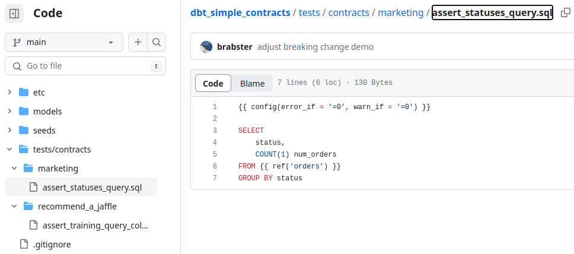

> [dbt announced "model contracts"](https://docs.getdbt.com/docs/collaborate/govern/model-contracts) in the recent v1.5 release. This looks like a great feature for dbt, but reminded me that I've been using contract testing with dbt for a couple of years now, [inspired by Pact](https://docs.pact.io/), but never talked about it. Whilst dbt's new feature is very dbt-centric, the approach I've used isn't - dbt certainly helps, but isn't necessary.

<!--more-->

## Why Contract Testing?

[Pact's Introduction](https://docs.pact.io/) gives a great overview of what contract testing is and why you need it. orrowing their words to explain what a contract is:

> In general, a contract is between a consumer (for example, a client that wants to receive some data) and a provider (for example, an API on a server that provides the data the client needs).

For an API-based digital product interface, a consumer-driven contract might say that in response to a query API call, the consumer expects a response in JSON containing a property "userId" that is a string. The provider can test any changes against the contract to ensure they do not break this expectation. The contract provides a means and a motivation for the consumer to clearly express important expectations.

The technical specifics aren't important. The same approach works with the same benefits for a SQL-based digital product interface. In this case, the same contract might say that in response to a SQL query, the consumer expects a table result containing a column "userId" that is a string.

## The Digital Jaffle Shop

I'll show you what I mean with [dbt-labs' Jaffle Shop demo project](https://github.com/dbt-labs/jaffle_shop) as our producer. In the lineage graph below, we can see some raw relations[^nomenclature] feeding some staging relations to produce a `customers` and an `orders` relation.


The right-most relations, `customers` and `orders`, are our customer-facing interface. The "upstream" relations are implementation details and hidden from consumers, ideally by permissions. Besides potentially protecting more sensitive data, this hiding of implementation detail is important for stable contracts - you'll see why later.

Consumers can only see `orders` and `customers`, so we only accept contracts against these relations.

## Recommend-A-Jaffle

Marketing is convinced that the next big thing in the jaffle industry is recommendations, so we've got a new consumer. This consumer needs to know a little about customers and orders, then they'll join that with other information in the business and perform some machine learning magic.

After some heavy duty, caffeine-fuelled data sciencing, the recommender team settles on this query to produce the data they need to train and test their model.:

```sql
SELECT
    customer_id,
    order_id,
    order_date,
    status
FROM jaffle_shop.orders
WHERE order_date > CURRENT_DATE - INTERVAL 90 DAY
```

The data produced by this query is munched by some machine learning models wrapped in Python code. The team building the consumer product is working flat out and could really do with some reliability from the producer, so they're happy to pop a ticket on the board to set up a contract with the Jaffle Shop producer.

## A Simple Contract

The recommender team could start simple with the query as it stands as a contract. We can turn it into an efficient test that the expected columns are present like this:

```sql
SELECT
    customer_id,
    order_id,
    order_date,
    status
FROM {{ ref('orders') }}
LIMIT 0
```

If a column is missing, the query will error out. If it succeeds, in most modern data warehouses, it will be optimised away by the `LIMIT 0`.

What the recommender team wants now is a way to provide this test to the Jaffle Shop team in such a manner that it must pass before a change can be rolled out. I'll show you what I think is the simplest way to do that next.

## A Simple Provide Contract Test Setup

We can just create a subdirectory of `tests/contract` in our `dbt` project, and have each consumer contribute their tests directly via a merge or pull request process. `dbt` will, by default, run their tests as part of a `build` or `test` operation.

Wait - a second consumer just showed up. Marketing need to run reports about how many orders are in the various order statuses. They want to make a contract too, so we help them put together the PR and we're left with this structure.



Let's run a `dbt test` for everything under contracts and see what happens...

```bashsession
jaffle_shop$ dbt test -s tests/contracts
...
21:29:39  1 of 2 START test assert_all_statuses .......................................... [RUN]
21:29:39  1 of 2 PASS assert_all_statuses ................................................ [PASS in 0.07s]
21:29:39  2 of 2 START test assert_training_query_columns ................................ [RUN]
21:29:39  2 of 2 PASS assert_training_query_columns ...................................... [PASS in 0.04s]
21:29:39  
21:29:39  Finished running 2 tests in 0 hours 0 minutes and 0.25 seconds (0.25s).
21:29:39  
21:29:39  Completed successfully
21:29:39  
21:29:39  Done. PASS=2 WARN=0 ERROR=0 SKIP=0 TOTAL=2
```

So far so good - if the consumers had submitted a contract test that didn't work against the current product then our pull request process would have caught it and prevented any confusion.

## Move Fast and Break Stuff. Or Not.

Let's make a dumb change that obviously breaks things - let's rename  a column - `status` to `order_status`.
We make the changes and run `dbt build --exclude tests/contracts` - all green. When we run the contract tests:

```bashsession
jaffle_shop$ dbt test -s tests/contracts
...
21:40:40  1 of 2 START test assert_all_statuses .......................................... [RUN]
21:40:40  1 of 2 ERROR assert_all_statuses ............................................... [ERROR in 0.07s]
21:40:40  2 of 2 START test assert_training_query_columns ................................ [RUN]
21:40:40  2 of 2 ERROR assert_training_query_columns ..................................... [ERROR in 0.05s]
21:40:40  
21:40:40  Finished running 2 tests in 0 hours 0 minutes and 0.27 seconds (0.27s).
21:40:40  
21:40:40  Completed with 2 errors and 0 warnings:
21:40:40  
21:40:40  Runtime Error in test assert_all_statuses (tests/contracts/marketing/assert_all_statuses.sql)
21:40:40    Binder Error: Column "status" does not exist on left side of join!
21:40:40  
21:40:40  Runtime Error in test assert_training_query_columns (tests/contracts/recommend_a_jaffle/assert_training_query_columns.sql)
21:40:40    Binder Error: Referenced column "status" not found in FROM clause!
21:40:40    Candidate bindings: "orders.order_status"
21:40:40  
21:40:40  Done. PASS=0 WARN=0 ERROR=2 SKIP=0 TOTAL=2
```
Boom! Our tests all passed, but the contract tests failed. We know this change would break our consumers, so we can adjust our approach accordingly.

## Summary

I've described a way of accepting contract test from your consumers and incorporating them into your development process.
Your consumers have full access to the power of SQL to make their assertions, and whilst `dbt` streamlines things, it's not strictly necessary that either provider or consumer uses it - the approach hinges on SQL can be adapted to suit your tooling.

Whilst you can use selectors to control when the contract tests run in your process, the simplicity of this approach has some downsides. You need to manage pull or merge requests into your repository based on directory structure, and I can't see a way for consumers to use `dbt`'s powerful declarative tests, like `not_null` and `unique`.

A more flexible and powerful approach would have a separate repo for your contract tests.
It's more to setup and manage, but gives access to the full capabilities and ease of use of `dbt` for contracts. Your consumers can define their queries as models and then make fine-grained assertions for them. You can deploy their models into a separate, suitably permissioned schema or database where they can be inspected for additional diagnostic capabilities.

[^nomenclature]: I use the less common term [`relation`](https://en.wikipedia.org/wiki/Relation_(database)) rather than `view` or `table` because a `relation` isn't specific and could be eitherI avoid `model` as it is a dbt-specific implementation detail rather than the interface consumers actually interact with.