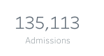
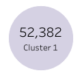
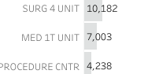

Since I wrote [my first consumer-driven SQL contracts post](../2023-05-19-dbt-contracts-in-sql/) I've had an opportunity to try the ideas out in a reporting and visualisation-centric context with a team that was interested in the idea.

<!--more-->

## Protecting Dashboards

The first concrete need we saw for a contract was between the data product and a Power BI dashboard. This dashboard groups visualisations like scorecards, line charts and data tables together for related metrics across numerous tabs. To do this, the dashboard selected specific columns from relations in the data product, applying filters and aggregations as needed. Then I asked myself what might go wrong.

I can't share the actual artefacts that we were working with, so I'll use a publicly available example to illustrate. [This PediatricsOverview Tableau visulisation, by Bridget Winds Cogley](https://public.tableau.com/app/profile/bridget/viz/PediatricsOverview/Overview), will serve well as an example.



We'll assert that the data behind this dashboard is produced by one or more SQL queries. There are a number of ways these visualisations could be "broken" by the source data changing after the dashboard was built.

### Obvious Errors

If the query, filtering or aggregation that a visualisation depends on could not be executed, you'll typically see an error message rather than the intended visualisation. Some examples of changes that could cause that kind of issue are:

- a column being removed or renamed
- the data type of the column changing, like a string becoming a number or a number becoming a date
- access for the dashboad to the data being removed
- the relation being renamed
- the relation being moved to a new schema or database

Dashboards may not have capabilities to proactively monitor and report these kinds of obvious issues, meaning that the next person who tries to look at the dashboard is the first opportunity you have to detect the problem, when the see something like this:



We can use a contract to express the needs that this dashboard has of the data. I created a single generic schema test, using the database's information schema, and avoiding use of dbt's refs, to test most of these expectations. I deferred testing access expectations as it seemed relatively unlikely to occur and it was not clear how best to test it.

### Does It Matter?

These kinds of problems may seem unlikely but they really do happen in reality. Whilst we had this contract being checked on a branch, it failed - because a piece of configuration was accidentally removed which altered the schema for an important relation. None of the normal test suite (which consisted over over 2000 dbt tests) picked up the issue. A supporting and very insightful team member I'll refer to as JF summed it up:

> A real "banging on the glass" moment...

### More Subtle Errors

Next, I paired with team members involved with building and assuring the dashboard to find out what else could go wrong. As it turns out - quite a lot. Here's a few examples of the kinds of things these conversations uncovered.

|Expected|Actual|Cause|
|-|-|-|
||135,113.2 admissions|Rounding error for an expected integer value in a float-value column|
||0 admissions|Missing data for the expected date ranges|
||77,412 admissions|Misclassified data for the expected date ranges|
||0 (Cluster 1)|Different filter value for "Cluster 1", clusters hardcoded into the dashboard|
||Cluster 1 missing|Different filter value for "Cluster 1", with clusters being generated from the data|
||"MED IT UNIT" missing|"MED IT UNIT" filtered out of the underlying data|
||"MED IT UNIT" 3003, "MED IT UNI" 4004|Typo "MED IT UNI" in some rows|

There are just a few illustrative examples to give you an idea of the fragility lurking under even a relatively simple dashboard. In our real case, we had a multi-page dashboard, where each page consisted of a set of interdependent visualisations designed to tell one facet of a mission critical story.

The impact of these kinds of issues will vary. Rounding errors on integer values might just be an irritation, but if this dashboard was being used to monitor something important, and a value that should be present disappeared from a list, it could create a blind spot for the organisation that would be difficult for anyone to notice by visual inspection.

We were able to capture these kinds of expectations in a SQL-based contract. These contracts run as part of the test suite during development and detect changes that break otherwise unstated and unchecked expectations before they affected the dashboards.

## What Worked Well

- able to capture almost all the expectations we established
- shifted detection of breaks into the causal development process
    - timely detection
    - preventative not reactive
- contract framing seemed to draw out much more detailed expectations than other kinds of interaction
- contracts effectively document the expectations as well as police them

## What Didn't Work So Well

- many expectations means many individual contracts-as-SQL
    - mitigated to an extent through use of dbt macros
- unable to use standard dbt tests-as-yaml
    - neat workaround to create an ephemeral view as `SELECT * FROM actual_schema.actual_model` and apply tests, docs - credit to team member JF for that one!
- complex and labour-intensive to encode assertions based on dashboard and reporting needs
    - taking an iterative approach helps get some high-value canary contracts in first and stopping when the cost is perceived to exceed the value
- mamy contract statements need the same reference data, such as date ranges for which specific data points are expected across multiple visualisations
    - made a decision from the outset to minimise leaking of contract-related machinery into the main dbt project
    - ephemeral models worked well to capture this kind of reusable reference data
- contract concept took a bit of explaining, and I'm probably still not doing a very good job of it!

## Wrapping Up

There's more to tell in this story but I'll call it here for this post.

Until next time - thanks to the client teams I've worked with for their patience as we've kicked the tyres on these data contract ideas!
