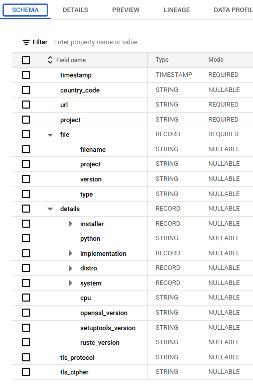
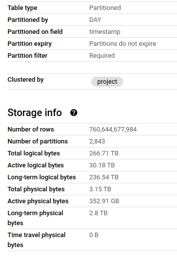
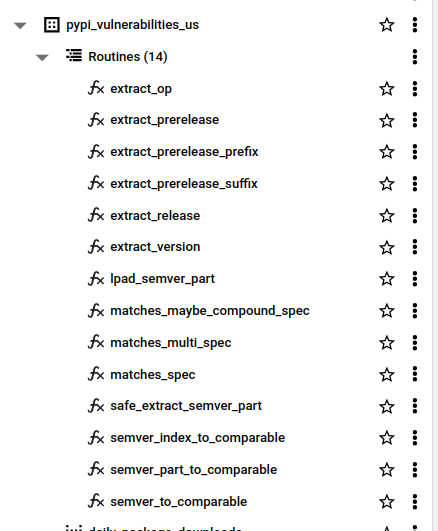

I try to automate updates of my software dependencies whereever I can, so try and minimise the risks I and my employer/client are exposed to.
I've been thinking over that position carefully to challenge and justify my position.
One task I set myself in this area was to see what I could learn about how the Python community handles dependencies and vulnerabilities.

<!--more-->


## PyPI BigQuery Dataset

The Python Packaging Authority publishes package download data to BigQuery ([PyPI documentation](https://warehouse.pypa.io/api-reference/bigquery-datasets.html), [Google blog post](https://cloud.google.com/blog/topics/developers-practitioners/analyzing-python-package-downloads-bigquery)). This public dataset seemed like a natural place to start in understanding how packages are used out there in the real world.

There are three tables in the dataset, one of which represents actual package downloads, `bigquery-public-data.pypi.file_downloads`. The Python Packaging User Guide produces some useful documentation about this table [here](https://packaging.python.org/en/latest/guides/analyzing-pypi-package-downloads/). Let's take a look at what we're dealing with.

|Schema|Details|
|------|-------|
|||

So this table has a complex schema, and is huge - **760 billion rows** and **3.15TB of physical bytes**.
Each download of a package from anywhere in the world is recorded as a row, so there's a lot of data here (not enough, but we'll get to that later).

The table is partitioned on timestamp day, so we can slice a single day of downloads out like this:

```sql
SELECT
  *
FROM `bigquery-public-data.pypi.file_downloads`
WHERE timestamp = '2024-01-10'
```

The query above is estimated to scan **245GB of data**, or a quarter of the 1TB limit that BigQuery allows in its sandbox. Ouch! When I started trying to analyse the data here, it became clear that I'd need to do some work on it to make it useful.

## Applying Analytics Engineering with DBT

I've been here before. I could start running ad-hoc queries to make the data more amenable to my analytics goals, but I'll end up making a bit of mess and it'll be hard to diagnose issues and share anything I find. Having started work on my [dbt_bigquery_template](https://github.com/brabster/dbt_bigquery_template), I decided to try it out with this problem. It certainly helped me skip the boilerplate and get to the analytical part faster - plus I found a few improvements and pushed those back for next time.

The resulting repository is [pypi-vulnerabilities](https://github.com/brabster/pypi_vulnerabilities). The models are publicly available and published to the US region at `pypi-vulnerabilities.pypi_vulnerabilities_us` - you can query this dataset today.

## What's in pypi-vulnerabilities-us?

There were a few problems I needed to solve before I could really get started on what I'm interested in. Here's a roughly chronological record of the problems and how I solved them.

### PyPI Data Volumes

I cut the data volume down by selecting and aggregating the columns I'm interested in, and then filtering for a single day, materializing the result.

A [dbt macro](https://github.com/brabster/pypi_vulnerabilities/blob/a0d55e20b88ccde4036c6d053abbf0cdb86a6b41/macros/ensure_single_day_downloads_materialized.sql) takes care of ensuring this materialization has been done, but doesn't re-run it. It's probably possible to do it by hacking an incremental model, but the macro is simple and got me moving.

That table is **4 million rows but only 26MB physical bytes**, so completely solves the data volumes problem whilst retaining all the information I need.

### Compatible and Meaningful Vulnerability Data

After a rather time-consuming and journey around sources of vulnerability data, I landed on a very simple solution. The good folks at [safetycli.com](https://safetycli.com) release a public updates to a vulnerability database each month on [GitHub](https://github.com/pyupio/safety-db). As well as `safety check`, this is the same data that [pipenv](https://pipenv.pypa.io/en/stable/advanced.html#detection-of-security-vulnerabilities) uses in its `pipenv check` cli function to tell you if you have any known vulnerable packages in your dependencies.

That seems like a great start - I know that the vulnerability information has been made publicly available, is available in cli tools for community and that the semver constraints match those being used in those tools.

I've got a little script to fetch the vulnerability database from GitHub at a date just over a month before my PyPI day snapshot in the repo [here](https://github.com/brabster/pypi_vulnerabilities/tree/a0d55e20b88ccde4036c6d053abbf0cdb86a6b41/etl). The big JSON array is processed into JSONLines and uploaded direct into a BigQuery table.

### Semver-Range Matching Functions

Now I need to glue the download data and the vulnerability data together. I want to get a column that tells me whether a given download was known vulnerable to something as a matter of public record at the time it was downloaded.

I couldn't find any functions I could call from BigQuery to process semver constraints. Semver isn't straightforward to process, but I worked from the [spec](https://semver.org/) as best I could. It took me a couple of days and 14 functions to solve the problem in pure SQL with enough test coverage to give me any confidence in correctness.



You'll find the [functions and documentation](hthttps://github.com/brabster/pypi_vulnerabilities/blob/a0d55e20b88ccde4036c6d053abbf0cdb86a6b41/macros/ensure_udfs.sql) with [tests](https://github.com/brabster/pypi_vulnerabilities/tree/a0d55e20b88ccde4036c6d053abbf0cdb86a6b41/tests) in the repo - of course you can call them in BigQuery from `pypi-vulnerabilities.pypi_vulnerabilities_us`.

The interface function, `matches_multi_spec(specs, package_version)` is used once, in [downloads_with_vulnerabilities](https://github.com/brabster/pypi_vulnerabilities/blob/a0d55e20b88ccde4036c6d053abbf0cdb86a6b41/models/downloads_with_vulnerabilities.sql#L8).

```sql
SELECT
    ...
    {{ target.schema }}.matches_multi_spec(vuln.specs, download.package_version) was_known_vulnerable_when_downloaded
FROM ...
```

I materialize this model as it takes a few seconds to process semver constraint matching over millions of rows and I'm really impatient (and I worry about burning rainforests for the sake of a tiny bit of work!)

### The Models

Given all that, the actual modelling part is relatively straightforward. I won't go into the details as there's a lot of detail and you can [see for yourself](https://github.com/brabster/pypi_vulnerabilities/tree/main/models).

I'll mention my first use of the preview SQL syntax [CUBE](https://cloud.google.com/bigquery/docs/reference/standard-sql/query-syntax#group_by_cube), in [this model](https://github.com/brabster/pypi_vulnerabilities/blob/a0d55e20b88ccde4036c6d053abbf0cdb86a6b41/models/download_vulnerability_cube.sql). It allows me to generate aggregations over permutations of groupings. I materialize this again as it takes 30-60s to execute, but then I can pull out aggregates consistently and efficiently for overall, by-installer and by-package style metrics. Big improvement over manually implementing multiple similar (see error-prone) views!

### GitHub Actions

Having put all this together in dbt, I have easy access to deploy, test and perform data quality tests for it all. I set up a [GitHub actions workflow](https://github.com/brabster/pypi_vulnerabilities/blob/a0d55e20b88ccde4036c6d053abbf0cdb86a6b41/.github/workflows/deploy.yml) to build and test all this stuff before publishing it to the publicly available dataset I've mentioned before. When I make changes, I should be able to publish them in a controlled, automated fashion - and I have the [basic scaffolding in place for consumer contracts](https://github.com/brabster/pypi_vulnerabilities/tree/main/tests/contracts/docs) ready for if they're needed.

## Analysis

Well - after all that I haven't had much time to perform analysis yet. A headline number: 5.2% of the downloads on that snapshot day were known vulnerable to something - or **over 32 million downloads**.

To be honest, my initial analysis pass left me with more questions than answers - and there was enough to talk about to get to this point.

Expect a follow up with some actual analysis. I'd love to hear any ideas or questions you have - or if you use this data to do something! I have social links in the post footer, or raise an issue on the repo.

Until next time...
