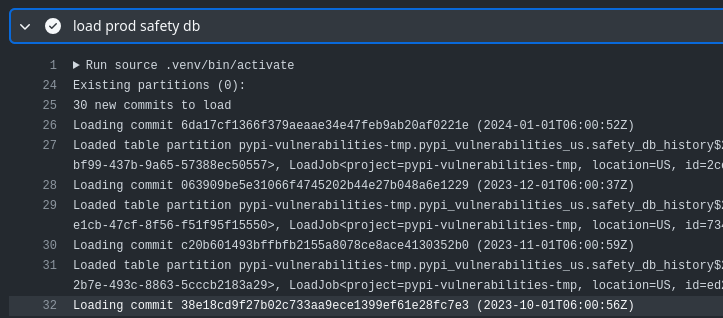
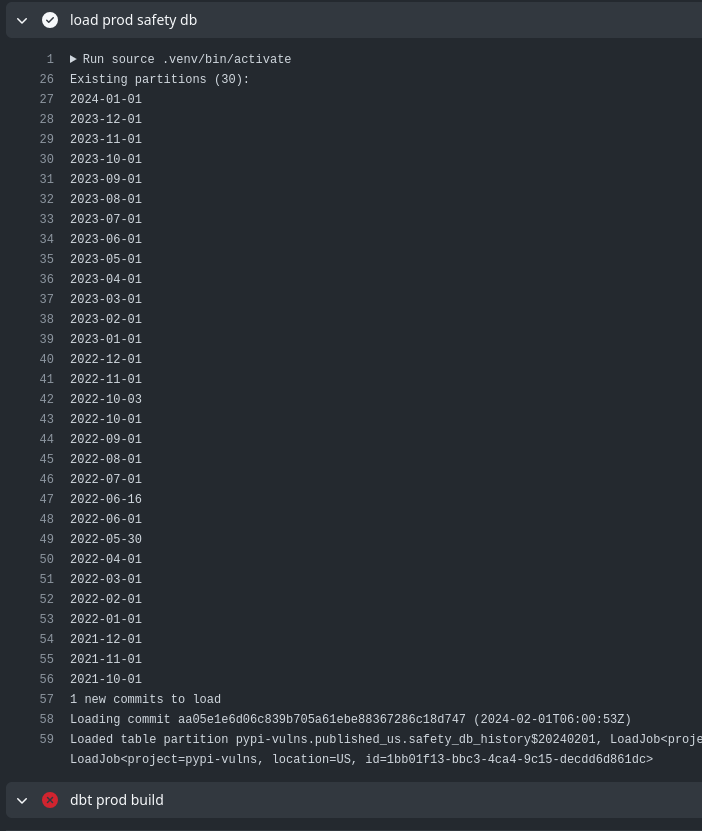
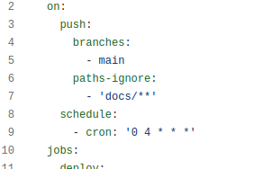

Following [initial exploration and setup](), I wanted to pull in more history from my safety and pypi sources to get a better idea of what might be happening. First up - a view of the Safety vulnerability database over time, explaining the challenges and decisions I made.

Thanks to [Equal Experts](https://equalexperts.com) for supporting this content.



<!--more-->

## In the Last Thrilling Episode...

I extracted a single SafetyDB snapshot from the month before the download data, built some functions to match semver constraints and created some views and tables to pull out more usable views of the data and some summary statistics. I used that data to produce an overall proportion of known-vulnerable downloads that day of 5.2% or around 32m downloads.

It turns out that number was **wrong** - it'll take a couple of posts to get to that though.

## Obtaining Safety History

I wanted to look further than just a single day's downloads. That would open up a lot of ways to look at patterns in the data and helps to avoid an atypical day leading to the wrong conclusions. In order to do that, I'll need both Safety DB and PyPI histories, so I started with Safety - being the smaller dataset.

Each month, [Safety Cybersecurity (formerly pyup.io)](https://github.com/pyupio) commit updates to the [safety-db repo](https://github.com/pyupio/safety-db). To establish a history, I need to work back through the commits, fetch the database JSON file, and load it into BigQuery. Not too challenging - the GitHub API is easy enough to work with to get the commit list and then the version of the file for each commit.

I don't know of any way to interact with GitHub in this way without scripting it myself, and I dont want to bring in any dependencies that aren't absolutely necessary. The script I wrote to do that is [here](https://github.com/brabster/pypi_vulnerabilities/blob/64812282d8c94d32a769723fdb99da3b2a97d861/etl/safety_db/load_missing_partitions.py). Essentially, it:

- gets the list of commits on the database file from GitHub
- checks which commits are already present in the target dataset table, filtering those out of the orignal list
- for each remaining commit
  - fetch the file content JSON
  - wrap the content with some metadata
  - merge into target dataset table

Given that the commit history is immutable, this approach avoids unnecessary time spent downloading and uploading data that we already have.

|Backfilling Safety DB history in [the first build](https://github.com/brabster/pypi_vulnerabilities/actions/runs/7716571519/job/21033677275)|
|-|
||

Note to self - I really need to sort a better solution for rich captioned figures! Anyway...

|[First build on Feb 2nd](https://github.com/brabster/pypi_vulnerabilities/actions/runs/7716571519/job/21033677275) loads February's commit|
|-|
||

## Taking a Look

The raw table isn't that useful, as it's organised as a list of vulnerabilities per package. I've laid a view over it to expand that into a row-per-vulnerability, which is much more useful. Example:

```sql
SELECT
  *
FROM `pypi-vulns.published_us.safety_vulnerabilities`
WHERE package = 'requests'
  AND commit_date BETWEEN '2023-10-01' AND '2023-11-01'
LIMIT 10
```

|package|commit_date|specs|cve|previous_commits|until_date|
|-------|-----------|-----|---|----------------|----------|
|requests|2023-10-01|"[>=2.1,<=2.5.3]"|CVE-2015-2296|26|2023-11-01|
|requests|2023-11-01|"[>=2.1,<=2.5.3]"|CVE-2015-2296|27|2023-12-01|
|requests|2023-10-01|"[>=2.3.0,<2.31.0]"|CVE-2023-32681|4|2023-11-01|
|requests|2023-11-01|"[>=2.3.0,<2.31.0]"|CVE-2023-32681|5|2023-12-01|
|requests|2023-11-01|[<=0.13.1]|PVE-2023-99936|0|2023-12-01|
|requests|2023-10-01|[<2.3.0]|CVE-2014-1829|26|2023-11-01|
|requests|2023-11-01|[<2.3.0]|CVE-2014-1829|27|2023-12-01|
|requests|2023-10-01|[<=2.19.1]|CVE-2018-18074|26|2023-11-01|
|requests|2023-11-01|[<=2.19.1]|CVE-2018-18074|27|2023-12-01|
|requests|2023-10-01|[<2.3.0]|CVE-2014-1830|26|2023-11-01|

We can see that `CVE-2015-2296` has been known about for a while, with 26 previous commits as of October 2023 (27 in November). `CVE-2023-32681` is much newer, and `PVE-2023-99936` has no previous commit - so it first appeared in the November 2023 update. The `until_date` column is computed over the sequence of commits using a [window (aka analytic) function](https://cloud.google.com/bigquery/docs/reference/standard-sql/window-function-calls), and it means we will easily be able to join each download with this vulnerability data based on the date of the download.

## Why Not External Tables?

I did consider dropping the JSON files into Cloud Storage and laying an external table over them, which would have allowed me to do more within DBT. I would still have needed to do something custom to interact with GitHub, and I would have still needed to figure out which commits I'd already seen and filter them out. It didn't seem worth introducing DBT-plus-a-package to the process I already had working so I left it be.

## Gotcha - BigQuery Sandbox Partition Expiration

After looking at options to merge a commit safely and efficiently into the target table, I settled on [partitioning the target table by date](https://github.com/brabster/pypi_vulnerabilities/blob/64812282d8c94d32a769723fdb99da3b2a97d861/etl/safety_db/bigquery.py#L3) and [overwriting the partition with WRITE_TRUNCATE](https://github.com/brabster/pypi_vulnerabilities/blob/64812282d8c94d32a769723fdb99da3b2a97d861/etl/safety_db/bigquery.py#L45) when I upload a given commit. Even if I do end up re-running any upload, I won't end up with duplicates to worry about.

That approach works fine - except when you're running in the BigQuery sandbox and partition expiration is automatically set to 60 days - that's 60 days from the partition timestamp, not the wall clock time when you write the data. Confused me for a while - I was sure what I was doing should work but somehow I only seemed to get the last couple of partitions showing up!

## Cutting my Losses with the Sandbox

At this point, knowing I was about to tackle the multi-terabyte PyPI downloads dataset I decided to cut my losses and move to a billed account. To avoid breaking changes, I left the original work in account `pypi-vulnerabilities` but relocated new work to `pypi-vulns` (as you can see from the example query above), which runs in my Tempered Works-attributed account, with billing set up.

This new dataset is still publicly available as dataset [`pypi-vulns.published_us`](ttps://console.cloud.google.com/bigquery?p=pypi-vulns&d=published_us&page=dataset) - I will deprecate the old one and remove it at some point in the future.

The BigQuery sandbox is an awesome capability for that initial exploration of the data and options. Limitations like the mandatory partition expiry would force me to do weird things to work around them, though. Moving to a billed account means I can keep things intuitive and - well - I expect it'll take a cash injection to process the download data.

## Keeping up to Date

Having sorted an idempotent upload of the latest Safety DB, it's just a case of adding a scheduled workflow to my GitHub actions build.
That just goes into source control for the workflow as a trigger (c'mon GitLab, it should be THIS EASY).



I run the whole workflow every day at 4am for now, so it'll redeploy the models, including recomputing any materialisations and run my test suite to pick up any data quality issues in new data.

## Next Time

How I dealt with that large PyPI dataset history without bankrupting myself.
