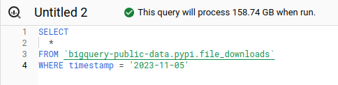
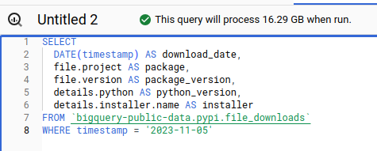
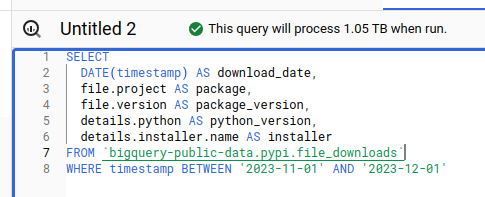
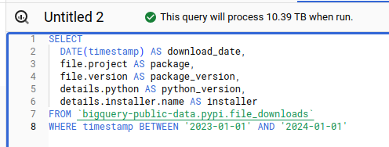
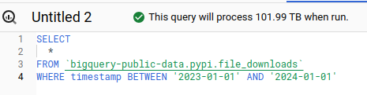
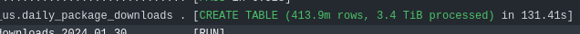
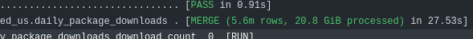

Given a historical view of the [Safety DB](), I need to get a historical view of PyPI downloads. The source dataset contains 274TB at time of writing, and grows every day - one naive query against that table could cost $1,370. A query over a single day can scan hundreds of GB, so I need to do some work to make it usable.

Thanks to [Equal Experts](https://equalexperts.com) for supporting this content.



<!--more-->

## Source Data Costs

The raw data contains a row per download, which explains the volume. If there are a million downloads of `requests==1.0.0` on a given day, that's a million rows. The data is partitioned by day, so we can limit the scan to a specific date range if add a `WHERE` clause with a constant value. Let's take a look at what BigQuery estimates scan volume will be for a few example queries. "Worst Cost" in the table below multiplies the scanned bytes by $5/TB for a worst-case cost,

|Comments|Query|Worst Cost|
|--------|-----|----------|
|All columns, one day||$0.79|
|Interesting columns, one day||$0.08|
|Interesting columns, one month||$5.25|
|Interesting columns, one year||$51.95|
|All columns, one year||$509.95|

We can see the date partitioning working here - the fewer days we query, the less we scan, the less it costs. Columnar storage also makes a big difference - if we select a few columns, we also scan and pay less than querying them all.

The table is set up to require a constraint in the where clause against the day-partitioned timestamp column - but we can see that it's still scarily easy to run up big bills.

## Big Bills

I think it's worth taking a moment to reflect on how how easy it is to spend money without realising here. Once I have a query in that window with any condition against the `timestamp`, column I can hit run (or crtl-return) to run it. Examples:

- I could mistype a date, so that instead of "greater than yesterday" billing around a dollar, I have "greater than yesterday's date last year". Boom - **$500** on the bill for a 1-character typo.
- Not realising why the condition on timestamp is required, I use something like "IS NOT NULL". Boom, **$1,370** on the bill - a pricey $100+ per character.
- I use a date constraint that isn't constant, for example the max date from another table. This one is really insidious because it looks like you have a constraint set, BigQuery will not prune partitions and will scan the whole table anyway! Boom, **$1,370** on the bill.

There are several ways you can mess up partition pruning, described here in [best practises](https://cloud.google.com/bigquery/docs/querying-partitioned-tables#best_practices_for_partition_pruning). Although there is a `max_bytes_billed` option you can set when you run queries programmatically, there is no way I can see of setting that in the UI. The "query settings" UI contains a whole bunch of weird and wonderful options, but doesn't offer a "don't bankrupt me without asking first" setting.

(Not true! See [update](#update-2024-02-17))

I find the scan estimates you can see in the screenshots incredibly helpful - but they only go so far. You can still run the query before the scan estimate comes back, the UI doesn't link those numbers to costs, on a smaller screen the numbers disappear off the side and if you're using other tooling, like say a Jupyter notebook - YOU WILL NEVER SEE THEM. Brutally sharp edges all round.

## Big Bills Fast

"But wait!", I hear you cry. "There's a cancel button there. Just cancel the query if it's scanning too much". It doesn't work that way. If you're used to a "traditional" database, the intuition would be that you'd notice the query was taking a while, do some checking, realise the mistake and cancel. 

Like all "modern hyperscale data warehouses", BigQuery isn't a relational database. It's massively distributed compute cluster that accepts jobs in SQL. You want to scan 274TB? No problem. BigQuery will slice up the work and throw it out to lots of machines to run in parallel. All that scanning may well have happened before you can cancel the job. Your 274TB query may even return as fast your 27.4GB query. It'll just cost you 2000x as much.

Exactly how long it'd take - I can't tell you. I'm not running that experiment for a blog post! Now just wait here a moment while I go close the browser window that had those sample queries in before I accidentally run a query I regret...

## The Plan - Making a Safer PyPI Downloads Dataset

My solution to this problem is to use partition pruning, column selection and aggregation to neutralise the financial threat this dataset represents. I'll run a query over a specific timeframe with just the columns I know I need and store the results in a new table. Then, I'll run a query on a scheduled basis, over a small time window that just includes what need since the last time I updated.

In dbt, this is called an [incremental model](https://docs.getdbt.com/docs/build/incremental-models). It's a simple enough idea - a query with a conditional part to it that adds conditions when existing data is found to merge in just the new data. 

## A Cautionary Tale

This was my first attempt, based on the dbt incremental models documentation:

```sql
{{
    config(
        materialized='incremental',
        unique_key=['download_date', 'package', 'package_version', 'installer'],
        on_schema_change='fail'
    )
}}

SELECT
  download_date,
  package,
  package_version,
  installer,
  COUNT(1) AS download_count
FROM {{ ref('file_downloads') }}
WHERE download_date >= DATE('{{ env_var("DBT_PYPI_EARLIEST_DOWNLOAD_DATE") }}')

-- this part only runs if the table already exists
-- to merge in the new rows since the last run

  AND download_date >= (SELECT MAX(download_date) FROM {{ this }})


GROUP BY
  download_date,
  package,
  package_version,
  installer
```

Yes, I know. You can see what I did wrong already. I'd just got to my hotel room the night before a client visit and had a couple of hours spare, so I set up this incremental load - WHERE THE DATE CONSTRAINT IS NOT CONSTANT!

Fortunately, I generally try to assume I'm an idiot, so I'd already done things to protect myself against screwing this up:

- I'd set up a billing alarm at predicted spend of £10
- I'd added `max_bytes_billed` to my dbt profile and set it low for my development target and higher for my "production" deployment
- I'd added that `DBT_PYPI_EARLIEST_DOWNLOAD_DATE` env var as a hard, constant low bound on the query, with no default so that I have to explicitly set it to run the query, and set the values within the last 3 months.

One of the tricky parts is that I'm expecting a hefty scan on the first run, as I need to backfill the history to `DBT_PYPI_EARLIEST_DOWNLOAD_DATE` - so when I saw 3.4TB scan for that model in the build log I wasn't surprised. I went to bed.

I was busy with client work for the next couple of days - I remembered to update the `max_bytes_billed` down from the 5TB I needed for the backfill to 50Gb I thought I'd need for the incrementals.
When I got home, I noticed a billing alarm in my email. I was expecting it as the first scan was a bit heavy, but I checked anyway - I realised I'd spent £40, when I was expecting ~£10. Looking into it, I noticed that the build at 50GB had failed. I realised that I was [getting a 3.4TB scan every time it ran](https://github.com/brabster/pypi_vulnerabilities/actions/runs/7734493314/job/21088578787), instead of the much smaller scan I was expecting for the incrementals.



## Fixing It

I realised the mistake, but the solution was a bit fiddlier than I expected. The only way I could see to keep the clause constant in a single query would be to query a time window into the past and merge the rows in the window. That's not great, because I'm trying to trade off cost of the scan for a larger time window vs. late data getting missed with shorter windows. What to do?

Run two queries!

```sql
{{
    config(
        materialized='incremental',
        unique_key=['download_date', 'package', 'package_version', 'installer'],
        on_schema_change='fail'
    )
}}


  SELECT MAX(download_date) FROM {{ this }}


-- go get the latest partition date before we run the merge query


SELECT
  download_date,
  package,
  package_version,
  installer,
  COUNT(1) AS download_count
FROM {{ ref('file_downloads') }}
WHERE download_date >= DATE('{{ env_var("DBT_PYPI_EARLIEST_DOWNLOAD_DATE") }}')

-- use the latest partition date which is a constant value in this query now

  AND download_date >= '{{ latest_partition_date }}'


GROUP BY
  download_date,
  package,
  package_version,
  installer
```

Now I'm running an initial query to find the latest partition date in the target table, and then query and merge new rows starting from that date, which is a constant now in the merge query. Nice and clean - but not front-and-centre in the dbt docs nor built into dbt incremental models. Now, my [daily merges run over 20-25GB](https://github.com/brabster/pypi_vulnerabilities/actions/runs/7794554168/job/21256082949#step:8:117), not 3.4TB!



## Materialized Views

I did consider using a [BigQuery materialized view](https://cloud.google.com/bigquery/docs/materialized-views-intro) to save all this hassle. I think it would have been the most cost-effective way of dealing with the problem, but you can't use a materialized view in one project based on data in another - so that idea went in the bin.

## Worst-Case Scenarios and Bullet-Dodging Effectiveness

(See [update](#update-2024-02-17) for more controls)

Had I done nothing to protect against excessive scan and spend, that mistake could have been a £1,370 per-run cost, over several runs.
For my specific query it'd likely be less than the full cost but it'd be hundreds of GBP per run. I don't see anything that would limit the spend that could easily have run to over £20k. How effective were those cost-protection measures I put in place?

- The billing alarm was not effective at all. Having a billing alarm set at £10 does me no good if I can run up a £20k bill in a few hours. By the time I get the email, I've lost my house.
- The `DBT_PYPI_EARLIEST_DOWNLOAD_DATE` as a hard minimum is what limited the scan to a couple of months in spite of my mistake, It was an effective guardrail.
- The `max_bytes_billed` constraint is what gave me a clear message that something was wrong and it prevented any further spend by erroring the queries. It was an effective guardrail and I've [raised an issue to remind me to incorporate it](https://github.com/brabster/dbt_bigquery_template/issues/10), with a nice low default limit, into my [dbt_bigquery_template](https://github.com/brabster/dbt_bigquery_template) project (which you're welcome to check out if you're looking to get started with dbt on BigQuery!).

There was one more control I had in place that I didn't mention before, but that protected me to this point. I did all my initial exploration in the BigQuery sandbox, which has a hard limit of 1TB scanned per month.
I'm going to be making efforts to do as much of my BigQuery work as possible in a sandbox account in future!

## The Optimised Data

This is running a bit long now, but I'll quickly show why the new view is so much safer and more efficient, at least for the kind of analysis I want to do.
The new table gives me download counts by day, package, version and installer.
It currently contains 451 billion rows and weighs in at 21.45GB. The maximum single query scan cost you can incur against this table is **10p**, and you can run around 100 queries over it within the monthly free tier.

Given that most of my queries are in specific date ranges, I could optimise further - but that's one for another day.

## Update 2024-02-17

There actually **is** a "don't bankrupt me" setting, although it's a pain to find. More importantly, there is a quota system lurking in there you can use for much more observable and effective control on a per-project or per-user over-time basis. Read more in [the next post in the series]().
